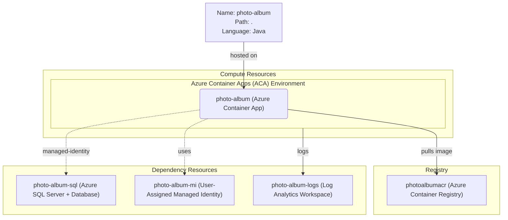

# Azure Deployment Plan for Photo Album Project

## **Goal**

Deploy the Photo Album Spring Boot application to Azure Container Apps in a new resource group and subscription using Azure CLI and Bicep for infrastructure provisioning.

---

## **Project Information**

**Photo Album**
- **Stack**: Spring Boot 3.4.4, Java 17
- **Type**: Photo storage and gallery web application (Thymeleaf MVC)
- **Build Tool**: Maven 3.9
- **Containerization**: Dockerfile present at `./Dockerfile`
- **Dependencies**: Azure SQL Database (Managed Identity), Spring Data JPA
- **Hosting**: Azure Container Apps

---

## **Azure Resources Architecture**

> **Install the mermaid extension in IDE to view the architecture.**

---

## **Existing Azure Resources**

| Resource Type | Name | SKU | Purpose |
|---------------|------|-----|---------|
| None | — | — | All resources will be created new |

**Missing Resources (to be provisioned):**
- Resource Group: `rg-photo-album`
- Azure Container Registry: `photoalbumacr` (Basic)
- Log Analytics Workspace: `photo-album-logs`
- Azure Container Apps Environment: `photo-album-env`
- Azure Container App: `photo-album`
- Azure SQL Server: `photo-album-sqlserver`
- Azure SQL Database: `photo-album-db`
- User-Assigned Managed Identity: `photo-album-mi`

---

## **Execution Steps**

> **Below are the steps for Copilot to follow. Add check list for the steps.**
> **CRITICAL: Do NOT run 'az login' until 'Env setup' step.**

### Step 1 – Containerization
- [x] Dockerfile exists at `./Dockerfile`
- [x] Multi-stage build: Maven 3.9.6 + OpenJDK 17 → eclipse-temurin:17-jre
- [x] Exposes port 8080
- Output: Docker artifact ready for ACR build

### Step 2 – Env Setup for AzCLI
- [ ] Install AZ CLI if not installed
- [ ] Verify default subscription with `az account show`
- [ ] Install Service Connector extension: `az extension add --name serviceconnector-passwordless --upgrade`

### Step 3 – Provisioning
- [ ] Use `infrastructure-bicep-generation` skill to generate Bicep IaC files
- [ ] Provision all missing Azure resources listed above
- [ ] Confirm all resources reach `provisioningState: Succeeded`

### Step 4 – Check Azure Resources Existence
- [ ] Azure Container Registry: `photoalbumacr` — check with `az acr show -o json`
- [ ] Azure Container Apps Environment: `photo-album-env` — check with `az containerapp env show -o json`
- [ ] Azure Container App: `photo-album` — check with `az containerapp show -o json`
- [ ] Azure SQL Server/Database: `photo-album-sqlserver` / `photo-album-db` — check with `az sql db show -o json`
- [ ] User-Assigned Managed Identity: `photo-album-mi` — check with `az identity show -o json`

### Step 5 – Deployment
1. **Azure Container App Deployment**:
   - [ ] Create deploy script: build image via `az acr build`, deploy to Azure Container App
   - [ ] Run deploy script and fix until successful
   - [ ] Configure environment variables: `DATABASE_SERVER_HOST_NAME`, `DATABASE_NAME`, `AZURE_MANAGED_IDENTITY_CLIENT_ID`
   - [ ] Assign User-Assigned Managed Identity to Container App
   - [ ] Grant Managed Identity `Directory Readers` + `db_owner` on Azure SQL
   - Output: Azure CLI scripts in `deploy-scripts/`

2. **Deployment Validation**:
   - [ ] Call `appmod-get-app-logs` to check application logs
   - [ ] Verify app is Running and healthy

### Step 6 – Summarize Result
- [ ] Call `appmod-summarize-result` to summarize deployment
- [ ] Generate `deployment-summary.md`

---

## **Progress Tracking**

See `progress.md` in this folder for step-by-step tracking.

---

## **Tools Checklist**

- [ ] appmod-analyze-repository
- [ ] appmod-plan-generate-dockerfile
- [ ] appmod-build-docker-image
- [ ] appmod-summarize-result
- [ ] appmod-get-app-logs
